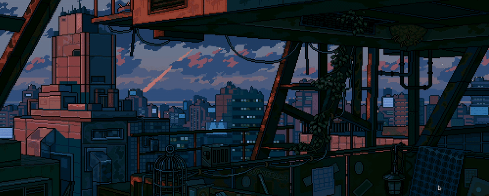

  
  

    <h1 style="color: #fff; font-size: 48px; text-shadow: 2px 2px 4px rgba(0,0,0,0.8); margin: 0;">
      Shiva Sai here!
    </h1>
    <h2 style="color: #00d4ff; font-size: 32px; text-shadow: 2px 2px 4px rgba(0,0,0,0.8); margin-top: 10px;">
    </h2>
  

<h3 style="color: #888;">Software Developer | CSE Student</h3>

 

  
  
  

---

<h2 style="color: #58A6FF;">👨‍💻 About Me</h2>

Passionate **Computer Science Student** focused on building efficient solutions and mastering algorithms.

- 🎓 Computer Science & Engineering undergraduate, 2nd Year
- 💻 Strong focus on **Data Structures & Algorithms (DSA)** and logic building
- 🚀 Interests: Problem-solving, Core Software Development, & UI Design
- 🎮 Hobbies: Story games (Expedition 33, Ghost of Tsushima, Elden Ring) & Music
- 🏆 **Finalist** at HACK4SDG (IIT Hyderabad)
- 📚 Constantly learning through projects, contests, and experimentation
- 🌟 Vision: Contribute to open-source & build impactful projects

 

 

<h2 style="color: #58A6FF;">🛠️ Tech Stack & Skills</h2>

<h3 style="color: #58A6FF;">💻 Programming Languages</h3>

<h3 style="color: #58A6FF;">🌐 Web Development</h3>

<h3 style="color: #58A6FF;">🎨 Design & Content</h3>

<h3 style="color: #58A6FF;">🗄️ Databases & Tools</h3>

<h2 style="color: #58A6FF;">🏅 Competitive Programming</h2>

<h2 style="color: #58A6FF;">📅 Contributions calendar</h2>

<h2 style="color: #58A6FF;">💬 Languages</h2>

<h2 style="color: #58A6FF;">📊 GitHub Stats</h2>

  

<h2 style="color: #58A6FF;">🚀 Featured Projects</h2>

<h3 style="color: #58A6FF;">🤖 Clari AI Meeting Assistant</h3>

> AI-powered meeting assistant and organizer

**Stack**: TypeScript, AI Integration  
**Features**: Automated meeting summaries, action item extraction  
**Focus**: Productivity enhancement through AI

[View Project →](https://github.com/Shiva-Sai-369/Clari-Ai-Meeting_Assistant)

<h3 style="color: #58A6FF;">🎓 Edualert (EduSync)</h3>

> AI-Powered Campus Management System

**Stack**: TypeScript  
**Features**: Intelligent attendance tracking, optimized room allocation, collaborative community platform  
**Achievement**: 🏆 Google TechSprint 2025  
**Focus**: Transform college experience with AI-powered solutions

[View Project →](https://github.com/Shiva-Sai-369/Edualert)

<h3 style="color: #58A6FF;">🎬 Raspiflix</h3>

> Netflix-style media streaming platform for Raspberry Pi

**Stack**: JavaScript, HTML, CSS  
**Features**: Movie browsing, favorites management, responsive design, custom media player  
**Focus**: Embedded entertainment systems with cinematic UI

[View Project →](https://github.com/Shiva-Sai-369/Raspiflix)

<h2 style="color: #58A6FF;">⏰ Coding Habits</h2>

<h2 style="color: #58A6FF;">🤝 Connect</h2>

 

**Open to:** Collaborations • Tech Discussions • Learning Opportunities

 

_"Learning logic, one bug at a time."_

  

